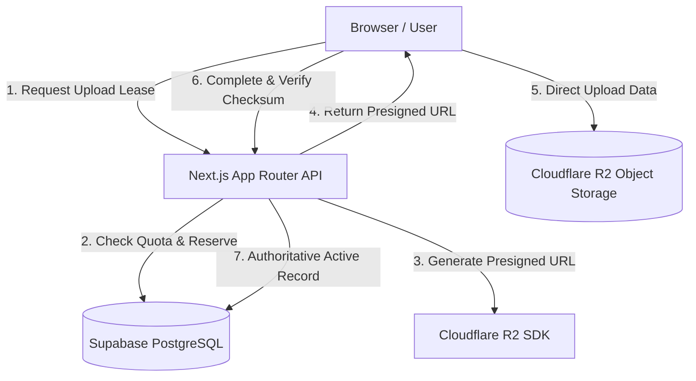

# GPHosting (gphost)

<div align="center">


**A modern, privacy-first file hosting and direct-sharing engine built with Next.js 16, Cloudflare R2, Supabase, and Upstash Redis.**

[](https://nextjs.org/)
[](https://react.dev/)
[](https://www.typescriptlang.org/)
[](package.json)
[](#)
[](LICENSE)

[Live Demo](https://gphost.eu.cc) • [Features](#-key-features) • [Architecture](#-architecture) • [Getting Started](#-getting-started) • [Environment Variables](#-environment-variables)

</div>

> ⚠️ **Project Status**: `v0.0.1-alpha` — This repository is in active early development and currently considered **unstable**. APIs, database schemas, and storage interfaces are subject to breaking changes.

---

## 🚀 Key Features

- ⚡ **Direct Cloudflare R2 Transfers**: Browser-to-storage uploads via presigned S3 URLs and multi-part chunking (up to 1 GB) with zero server bandwidth bottleneck.
- 🔒 **Privacy-First Public Share Links**:
  - Custom link expiration (`24h`, `7d`, `30d`, `90d`, or permanent).
  - Single-use self-destructing downloads.
  - PBKDF2/SHA-256 password protection for private files.
  - Nuclear link deletion with instant cascade.
- 🛡️ **Comprehensive Security**:
  - Cloudflare Turnstile bot verification & PIN-gated access.
  - Zero exposure of internal storage keys, ETags, or user IDs to clients.
  - Strict Content-Security-Policy (CSP) headers and download proxy isolation.
- 📊 **Unified Single-Screen Dashboard**:
  - Real-time quota tracking and tier monitoring.
  - Instant file manager with debounced search, category filtering, and sorting.
  - One-click share link generator and short-link integration.
  - Interactive Yes/No confirmation dialogs for all destructive operations.
- ⚡ **Automated Background Lifecycle**:
  - Daily cleanup jobs for expired files and orphaned single-use links.
  - Soft-delete grace periods with asynchronous R2 purge reconciliation.

---

## 🏗️ Architecture



---

## 🛠️ Tech Stack

- **Framework**: [Next.js 16 (App Router)](https://nextjs.org/)
- **UI & Styling**: React 19, Tailwind CSS v4, Lucide Icons, Vanilla CSS Design System
- **Database & Auth**: [Supabase](https://supabase.com/) (PostgreSQL with RLS & Stored Procedures)
- **Object Storage**: [Cloudflare R2](https://developers.cloudflare.com/r2/) (S3-compatible, zero egress fees)
- **Caching & Rate Limiting**: [Upstash Redis](https://upstash.com/) (Sliding window rate limiters)
- **Bot Defense**: [Cloudflare Turnstile](https://www.cloudflare.com/products/turnstile/)

---

## 💻 Getting Started

### Prerequisites
- Node.js 20+ and npm / pnpm / bun
- A Cloudflare account with an R2 bucket configured
- A Supabase project
- An Upstash Redis database (optional for production rate limiting)

### 1. Clone the repository
```bash
git clone https://github.com/your-username/gphost.git
cd gphost
```

### 2. Install dependencies
```bash
npm install
```

### 3. Configure Environment Variables
Copy `.env.example` to `.env.local` and populate the required keys:
```bash
cp .env.example .env.local
```

### 4. Apply Database Migrations
Execute the SQL files located in `supabase/migrations/` inside your Supabase SQL Editor.

### 5. Run Development Server
```bash
npm run dev
```
Open [http://localhost:3000](http://localhost:3000) in your browser.

---

## 🔑 Environment Variables

```env
# App URL
NEXT_PUBLIC_APP_URL=https://gphost.eu.cc

# Supabase
NEXT_PUBLIC_SUPABASE_URL=https://your-project.supabase.co
NEXT_PUBLIC_SUPABASE_ANON_KEY=your-anon-key
SUPABASE_SECRET_KEY=your-service-role-key

# Cloudflare R2
R2_ACCOUNT_ID=your-cloudflare-account-id
R2_ACCESS_KEY_ID=your-r2-access-key-id
R2_SECRET_ACCESS_KEY=your-r2-secret-access-key
R2_BUCKET_NAME=your-bucket-name
R2_PUBLIC_DOMAIN=your-custom-r2-domain.com

# Cloudflare Turnstile
NEXT_PUBLIC_TURNSTILE_SITE_KEY=your-turnstile-site-key
TURNSTILE_SECRET_KEY=your-turnstile-secret-key

# Upstash Redis
UPSTASH_REDIS_REST_URL=https://your-upstash-instance.upstash.io
UPSTASH_REDIS_REST_TOKEN=your-upstash-token
```

---

## 📜 Scripts

| Command | Description |
| :--- | :--- |
| `npm run dev` | Starts the Next.js local development server |
| `npm run build` | Builds the production bundle |
| `npm run start` | Runs the built production application |
| `npm run typecheck` | Validates TypeScript types across the codebase |
| `npm run lint` | Lints files with ESLint rules |

---

## 📄 License

This project is licensed under the MIT License - see the [LICENSE](LICENSE) file for details.
