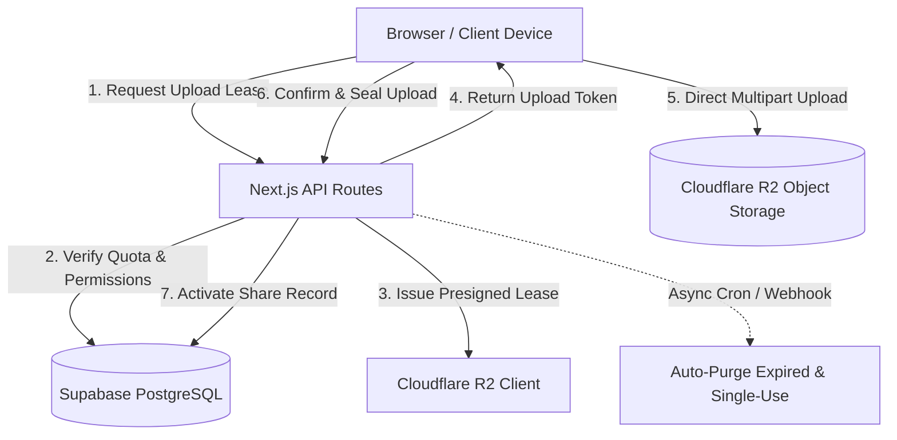

# GPHosting (gphost)

<div align="center">


**A high-performance, privacy-first ephemeral file hosting and direct-transit platform built with Next.js 16 (Turbopack), Cloudflare R2, Supabase, and Upstash Redis.**

[](https://nextjs.org/)
[](https://react.dev/)
[](https://www.typescriptlang.org/)
[](public/manifest.webmanifest)
[](LICENSE)

[Live Platform](https://gphost.eu.cc) • [Capabilities](#-core-capabilities) • [System Architecture](#-system-architecture) • [Getting Started](#-getting-started) • [License Terms](#-license--usage-terms)

</div>

---

## ⚡ Core Capabilities

- 🚀 **Direct Browser-to-Storage Transfers**:
  - High-throughput direct uploads to Cloudflare R2 using presigned S3 URLs and multipart chunking (up to 1 GB) with zero server bandwidth saturation.
  - Non-blocking client upload coordinator with real-time progress indicators, chunk verification, and automatic retries.

- ⏱️ **Ephemeral Lifecycle & Burn-After-Read**:
  - Configurable Time-to-Live (TTL) policies (`24h`, `7d`, `30d`, `90d`, or permanent for authorized users).
  - Autonomous self-healing lifecycle: automatic background reconciliation via Next.js background workers and native Supabase pg_cron (zero external cron dependencies, 100% Vercel Hobby plan compatible).

- 🔗 **Adaptive Link Sharing & Official Domain Routing**:
  - Dynamic origin resolution: automatically serves local share routes (`http://localhost:3000/f/...`) during local testing and production routes (`https://gphost.eu.cc/f/...`) when deployed.
  - Integrated XURL shortlink engine with automatic redirection to the official public domain for developer environments.

- 🛡️ **Zero-Knowledge Security & Defense**:
  - Cryptographic password protection with client-side hashing (PBKDF2 / Argon2id).
  - Cloudflare Turnstile bot verification and invite PIN-gated registration access.
  - Resilient sliding-window rate limiters with fail-open circuit breakers to prevent denial-of-service and protect quotas.
  - Strict Content-Security-Policy (CSP) headers and sandboxed download proxy protection.

- 📱 **Full 360° Branding & Progressive Web App (PWA)**:
  - Unified vector brand identity across all touchpoints (vault geometric emblem).
  - Complete multi-resolution favicon suite, high-DPI Apple Touch Icons, and Android maskable icons.
  - Installable PWA manifest with standalone display configuration and automated OpenGraph social preview generation.

- 🎛️ **Unified Management Console**:
  - Real-time storage quota gauges, debounced search, category filtering, and instant preview modal.
  - Built-in administrative dashboard for user approvals, PIN management, and storage reconciliation.

---

## 🏗️ System Architecture



---

## 🛠️ Tech Stack

| Layer | Technology |
| :--- | :--- |
| **Framework** | [Next.js 16](https://nextjs.org/) (App Router, Turbopack) |
| **Frontend** | [React 19](https://react.dev/), Tailwind CSS, Lucide Icons |
| **Database & Auth** | [Supabase](https://supabase.com/) (PostgreSQL with RLS, Session Management) |
| **Object Storage** | [Cloudflare R2](https://developers.cloudflare.com/r2/) (Zero-egress S3 API) |
| **Cache & Limiting** | [Upstash Redis](https://upstash.com/) (Resilient sliding-window limiters) |
| **Bot Mitigation** | [Cloudflare Turnstile](https://www.cloudflare.com/products/turnstile/) |
| **Hosting & Runtime** | [Vercel](https://vercel.com/) (Next.js Edge & Serverless; 100% Hobby & Pro compatible) |

---

## 💻 Getting Started

### Prerequisites
- Node.js 20.9.0 or higher (`npm`, `pnpm`, or `bun`)
- A Cloudflare account with an R2 bucket
- A Supabase project
- (Optional) An Upstash Redis instance for production rate limiting

### 1. Clone the repository
```bash
git clone https://github.com/AspiringWebGaurav/gphost.git
cd gphost
```

### 2. Install dependencies
```bash
npm install
```

### 3. Environment Configuration
Copy the provided `.env.example` template to `.env.local` and supply your project credentials:
```bash
cp .env.example .env.local
```
*(Refer to [`.env.example`](.env.example) for the documented schema of required and optional keys).*

### 4. Database Schema
Execute the SQL migrations located in `supabase/migrations/` within your Supabase SQL editor to create the required tables, triggers, and Row Level Security policies.

### 5. Launch Development Server
```bash
npm run dev
```
Navigate to [http://localhost:3000](http://localhost:3000) to access the local environment.

---

## 📜 Available Scripts

| Command | Action |
| :--- | :--- |
| `npm run dev` | Starts the Next.js Turbopack development server |
| `npm run build` | Compiles an optimized production build |
| `npm run start` | Runs the compiled production server |
| `npm run lint` | Checks codebase against ESLint rules |
| `npm run typecheck` | Validates TypeScript types across the project (`tsc --noEmit`) |
| `npm run clean` | Cleans Next.js build caches and temp artifacts |
| `npm run total-clean` | Performs a deep cleanup including `node_modules` |

---

## 📄 License & Usage Terms

This project is released under a **Source-Available Reference License**.

- **Permitted**: You are free to view, read, clone, audit, and evaluate the source code for personal, non-commercial, educational, and security research purposes.
- **Restrictions**: Commercial use, unauthorized public re-hosting, SaaS redistribution, reselling, or removing proprietary brand marks is strictly prohibited without prior written consent from the author.

For complete legal terms, please review the [LICENSE](LICENSE) file.
